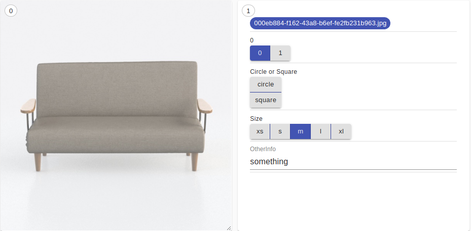

classification labeling
===================================

trescope provides efficient interfaces for labeling whenever need, for example, one need to label the leg attribute in image,
total attributes are: circle leg, square leg, another leg attribute is size, total attributes are: **xs, s, m, l, xl**.
trescope is easy to accompany this task, use the following command to plot them

.. code-block:: python

   Trescope().selectOutput(sample_index * 2).plotImage(full_image_path).withConfig(ImageConfig())
    (Trescope().selectOutput(sample_index * 2 + 1).asInput()
        .addControl(Label().id('file').label(model_image_path).value(full_image_path))
        .addControl(EnumControl().id('0').label('0').enumeration(0, 1).defaultValue(0))
        .addControl(EnumControl().id('shape').label('Circle or Square').enumeration('circle', 'square').style('vertical'))
        .addControl(EnumControl().id('thickness').label('Size').enumeration('xs', 's', 'm', 'l', 'xl').defaultValue('m'))
        .addControl(TextControl().id('otherInfo').label('OtherInfo').defaultValue('something'))
        )

firstly, plot image or pointcloud or mesh in selected grid, secondly, using **Label()** to name the image path or something related,
the key part is **EnumControl()**, **id()** specifies the name, **label()** specifies the meaning shown in grid for labeling,
**EnumControl()** specifies all the attributes, btw, this is not required, one can set the default value using 
**defaultValue('something')**.

pose labeling
===================================

we will support object pose labeling, stay tuned.