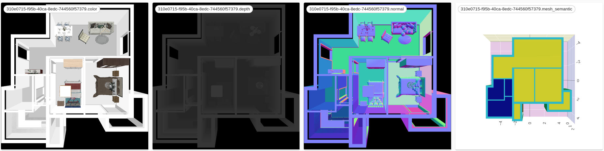
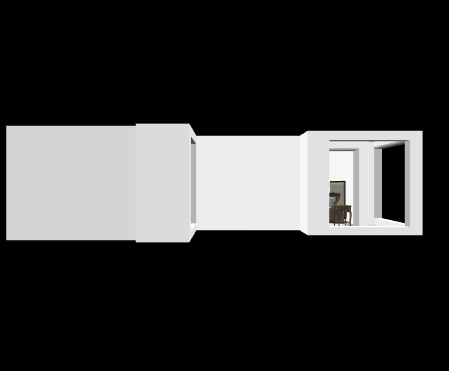

3d front plot
==============

trescope support visualization of various 3D data types, such as mesh, voxel, point cloud and so on,
it is worth mentioning that we also support 3D-FRONT \ :sup:`[1]`\ dataset visualization(which is a fantastic scene dataset from Alibaba)

different renderType
~~~~~~~~~~~~~~~~~~~~~~~~~~~~~~~~~~~~~~~~~~~~

to plot with **color** renderType:

.. code-block:: python

    Trescope().selectOutput(9).plotFRONT3D('../data/res/3D-FRONT-samples/scenes/310e0715-f95b-40ca-8edc-744560f57379.json').withConfig(
    FRONT3DConfig()
        .view('top')
        .renderType('color')
        .shapeLocalSource('../data/res/3D-FRONT-samples/3D-FUTURE-model')
        .hiddenMeshes(['Ceiling', 'SlabTop', 'ExtrusionCustomizedCeilingModel']))

one can change **renderType** like: color, depth, normal, mesh_semantic

different view Type
~~~~~~~~~~~~~~~~~~~~~~~~~~~~~~~~~~~~~~~~~~~~

.. code-block:: python

    Trescope().selectOutput(10).plotFRONT3D('../data/res/3D-FRONT-samples/scenes/310e0715-f95b-40ca-8edc-744560f57379.json').withConfig(
        FRONT3DConfig()
            .view('front')
            .renderType('color')
            .shapeLocalSource('../data/res/3D-FRONT-samples/3D-FUTURE-model')
            .hiddenMeshes(['Ceiling', 'SlabTop', 'ExtrusionCustomizedCeilingModel']))

 
.. code-block:: bash

    @article{fu20203dfront,
        title={3D-FRONT: 3D Furnished Rooms with layOuts and semaNTics},
        author={Fu, Huan and Cai, Bowen and Gao, Lin and Zhang, Lingxiao and Li, Cao and Zeng, Qixun and Sun, Chengyue 
                and Fei, Yiyun and Zheng, Yu and Li, Ying and Liu, Yi and Liu, Peng and Ma, Lin and Weng, Le and Hu, Xiaohang 
                and Ma, Xin and Qian, Qian and Jia, Rongfei and Zhao, Binqiang and Zhang, Hao},
        journal={arXiv preprint arXiv:2011.09127},
        year={2020}
    }